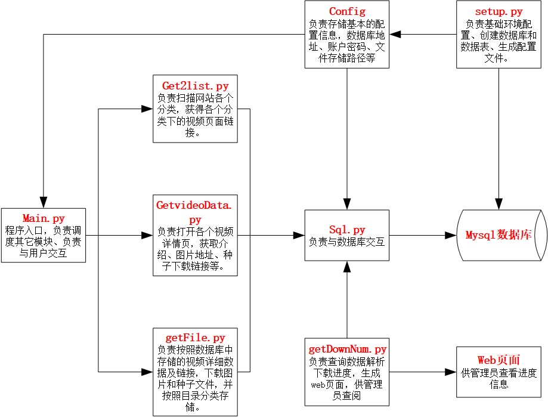

# 桃*族网站爬取器

## 一、功能

​		本爬虫可以爬取桃*族论坛的视频页面链接、一级分类、二级分类、标题、介绍、图片和种子等。可以将相关数据存储到MySQL数据库，并且可以将文件下载到本地。模块化开发，具有修改便捷、兼容性好等特点。

## 二、基础环境

​		本爬虫依赖以下环境：

​				基础环境：python3、MySQL、wget

​				python包：pymysql、requests、lxml、argparse、json、os、re

​				运行环境：Linux、Windows（需wget支持）

## 三、程序结构

​		

## 四、使用方法

​		初次使用，需要先部署python3环境，确认wget可被程序调用，部署MySQL，为程序新建MySQL账户，账户最小权限要求能够新建数据库，在新建的数据库里拥有对数据表的新建、查询、写入、修改权限。

​		在部署好基础环境后，执行以下命令：

```bash
python setup.py
```

​		根据程序提示输入信息，程序执行完成后，会在目录创建config文件，内明文保存数据库账号密码，请注意妥善保存。

​		执行以下命令获得帮助：

```bash
python main.py -h
```

​		示例运行 假如桃*族网站的网址为 www.baidu.com

```bash
python main.py -u "http://www.baidu.com/"
```

​		在不设置deep或deep为-1时，默认扫描站点内全部分类的全部页面，耗时非常大，仅建议初次使用时使用默认选项。当deep为大于0的具体数值时，则代表在分类下仅扫描前几页。如deep设置为10，代表仅扫描十页即止。

```bash
python main.py -u "http://www.baidu.com/" -d 10
```


## 五、法律声明

​		本程序及其中间产物和输出物，在中国大陆仅限学习研究爬虫类技术使用，禁止用于获取非法收益，禁止以任何形式发售本程序及其产物，该程序中间产物及输出物不可在中国大陆传播、发售。

​		本程序内部未提供任何网址的链接，需要使用者指定链接，否则无法获取任何资源，故不涉及故意传播未备案网站等情况。

​		请您在中国大陆、网站所属国及资源版权所属国的法律约束下使用本程序，请您详细了解使用本程序及其输出产物、中间产物所可能造成的法律风险，并承诺由您完全担负对应的法律风险，如您无法充分理解或不同意上述要求，请您不要使用、分析本程序及其中间产物和输出物。
